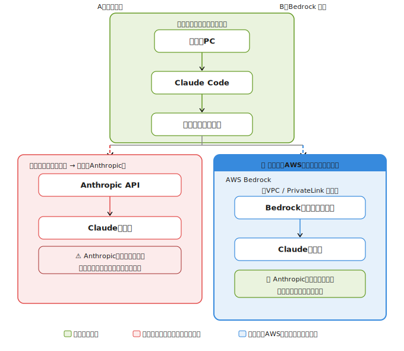

# Claude Code 接続経路とデータ保護範囲

直接接続とAWS Bedrock経由の2つの経路における、データの到達範囲と安全性の違いを示す。

---

## 補足

| 項目 | A：直接接続 | B：Bedrock経由 |
|---|---|---|
| データの到達先 | Anthropicサーバー | 自社AWSアカウント内 |
| Anthropicによる参照 | 可能性あり | **不可** |
| 学習利用リスク | プラン次第であり | **なし** |
| インターネット経由 | あり | VPC/PrivateLink経由 |

> **「自社専用AWSアカウント」について**
> AWSはパブリッククラウドだが、アカウント単位で完全に分離されており、
> 他社やAnthropicからはアクセスできない。データの管理権限は自社に閉じている。
