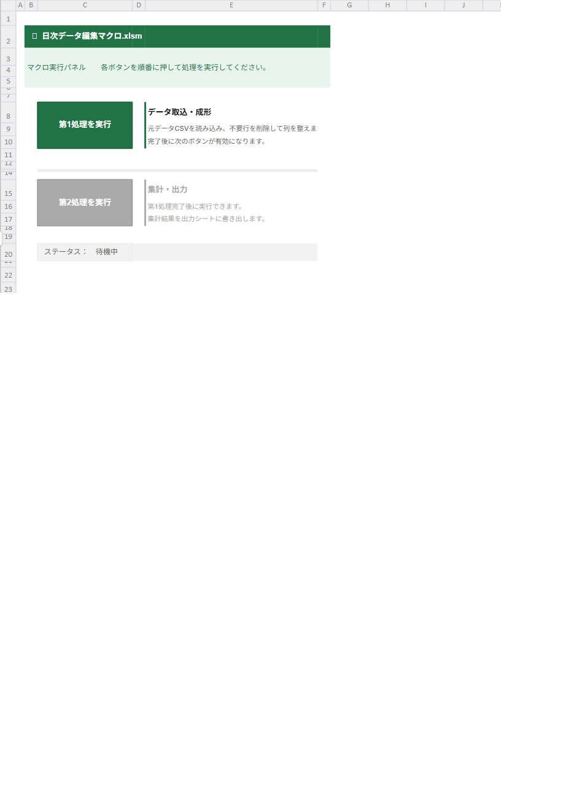

---
---

# Excel画面サンプル



# sample

```vba
' 指定セルを起点に1グループ（ticket行＋子行）を返す
' 戻り値：Rangeオブジェクト（グループ全体）
Function GetGroup(startCell As Range) As Range

    Dim ws       As Worksheet
    Dim typeCol  As Long
    Dim lastRow  As Long
    Dim i        As Long

    Set ws      = startCell.Worksheet
    typeCol     = startCell.Column
    lastRow     = ws.Cells(ws.Rows.Count, typeCol).End(xlUp).Row

    ' startCellがticketでなければ何も返さない
    If startCell.Value <> "ticket" Then
        Set GetGroup = Nothing
        Exit Function
    End If

    ' ticket行の次の行から、次のticket or 末尾まで走査
    Dim groupEnd As Long
    groupEnd = startCell.Row  ' 最低でもticket行自身

    For i = startCell.Row + 1 To lastRow
        If ws.Cells(i, typeCol).Value = "ticket" Then Exit For
        groupEnd = i
    Next i

    Set GetGroup = ws.Range(ws.Cells(startCell.Row, typeCol), _
                            ws.Cells(groupEnd, typeCol))

End Function
```
# sample2

```vba
Dim deleteRange As Range  ' 削除対象を蓄積
Dim grp As Range
Dim i As Long
Dim lastRow As Long

lastRow = ws.Cells(ws.Rows.Count, 1).End(xlUp).Row
i = 2

Do While i <= lastRow

    Set grp = GetGroup(ws.Cells(i, 1))

    If Not grp Is Nothing Then

        ' ○/×判定して削除対象を収集
        If grp.Rows.Count > 1 Then
            If grp.Cells(2, 1).Value = "○" Then
                Dim r As Range
                For Each r In grp.Cells
                    If r.Value = "×" Then
                        If deleteRange Is Nothing Then
                            Set deleteRange = r
                        Else
                            Set deleteRange = Union(deleteRange, r)
                        End If
                    End If
                Next r
            End If
        End If

        i = grp.Cells(grp.Rows.Count, 1).Row + 1  ' 次のグループ先頭へ
    Else
        i = i + 1
    End If

Loop

' 最後に一括削除
If Not deleteRange Is Nothing Then
    deleteRange.EntireRow.Delete
End If
```
