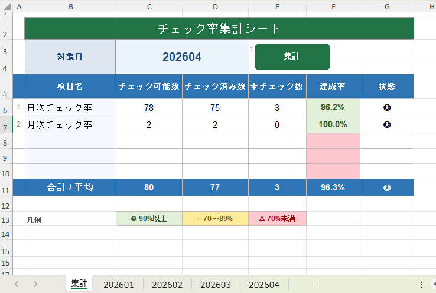

---
---

# Excel画面サンプル



# ThisWorkBook

```vba
Private Sub Workbook_Open()
    Call UpdateMonthCombo
End Sub
```

# Sheet1

```vba
Private Sub Worksheet_Activate()
    Call UpdateMonthCombo
End Sub
```

# Module1（コンボボックス）

```vba
Sub UpdateMonthCombo()

    Dim ws       As Worksheet
    Dim wsSum    As Worksheet
    Dim months() As String
    Dim cnt      As Integer

    Set wsSum = ThisWorkbook.Worksheets("集計")
    cnt = 0

    For Each ws In ThisWorkbook.Worksheets
        If IsMonthSheet(ws.Name) Then
            cnt = cnt + 1
            ReDim Preserve months(1 To cnt)
            months(cnt) = ws.Name
        End If
    Next ws

    If cnt = 0 Then
        MsgBox "対象シートが見つかりません。", vbExclamation
        Exit Sub
    End If

    With wsSum.Range("C3:D4").Validation
        .Delete
        .Add Type:=xlValidateList, _
             AlertStyle:=xlValidAlertStop, _
             Formula1:=Join(months, ",")
        .IgnoreBlank = False
        .InCellDropdown = True
        .ShowError = True
        .ErrorTitle = "入力エラー"
        .ErrorMessage = "リストから選択してください"
    End With

    wsSum.Range("C3").Value = months(cnt)

End Sub

Function IsMonthSheet(sName As String) As Boolean
    Dim yr As Integer, mo As Integer
    If Len(sName) <> 6 Then Exit Function
    If Not IsNumeric(sName) Then Exit Function
    yr = CInt(Left(sName, 4))
    mo = CInt(Right(sName, 2))
    IsMonthSheet = (yr >= 2000 And yr <= 2099 And mo >= 1 And mo <= 12)
End Function
```

# Module2（集計）

```vba
Option Explicit

Private Const ROW_ITEM_START As Long = 4
Private Const COL_DATE_START As Long = 2
Private Const NUM_DAILY      As Long = 3
Private Const NUM_MONTHLY    As Long = 2


' [実行対象] 集計ボタンに割り当てる
Sub BuildSummary()

    Dim wsSum           As Worksheet
    Dim wsMonth         As Worksheet
    Dim sMonth          As String
    Dim lastCol         As Long
    Dim todayCol        As Long
    Dim numDays         As Long
    Dim r               As Long
    Dim c               As Long
    Dim dailyPossible   As Long
    Dim dailyChecked    As Long
    Dim monthlyPossible As Long
    Dim monthlyChecked  As Long
    Dim targetYear      As Integer
    Dim targetMonth     As Integer
    Dim today           As Date
    Dim cutoffDay       As Integer

    Set wsSum = ThisWorkbook.Worksheets("集計")
    sMonth = wsSum.Range("C3").Value

    If sMonth = "" Then
        MsgBox "対象月を選択してください。", vbExclamation
        Exit Sub
    End If

    If Not SheetExists(sMonth) Then
        MsgBox sMonth & " のシートが見つかりません。", vbCritical
        Exit Sub
    End If

    Set wsMonth = ThisWorkbook.Worksheets(sMonth)

    ' 対象月の年・月を取得
    targetYear = CInt(Left(sMonth, 4))
    targetMonth = CInt(Right(sMonth, 2))
    today = Date

    ' 集計の打ち切り日を決定
    ' 対象月が当月 → 今日の日付まで / 過去月 → 月末まで
    If targetYear = Year(today) And targetMonth = Month(today) Then
        cutoffDay = Day(today)
    Else
        cutoffDay = Day(DateSerial(targetYear, targetMonth + 1, 0))
    End If

    ' 日付ヘッダー行（3行目）から打ち切り列を特定
    lastCol = wsMonth.Cells(3, Columns.Count).End(xlToLeft).Column
    todayCol = 0
    For c = COL_DATE_START To lastCol
        If wsMonth.Cells(3, c).Value = cutoffDay Then
            todayCol = c
            Exit For
        End If
    Next c

    ' 打ち切り列が見つからない場合は最終列を使用
    If todayCol = 0 Then todayCol = lastCol

    numDays = todayCol - COL_DATE_START + 1

    ' 日次（上3項目）：1日?打ち切り日まで
    dailyPossible = numDays * NUM_DAILY
    dailyChecked = 0
    For r = ROW_ITEM_START To ROW_ITEM_START + NUM_DAILY - 1
        For c = COL_DATE_START To todayCol
            If wsMonth.Cells(r, c).Value = "◯" Then
                dailyChecked = dailyChecked + 1
            End If
        Next c
    Next r

    ' 月次（下2項目）：月全体で1回以上◯があれば達成
    monthlyPossible = NUM_MONTHLY
    monthlyChecked = 0
    For r = ROW_ITEM_START + NUM_DAILY To ROW_ITEM_START + NUM_DAILY + NUM_MONTHLY - 1
        For c = COL_DATE_START To lastCol
            If wsMonth.Cells(r, c).Value = "◯" Then
                monthlyChecked = monthlyChecked + 1
                Exit For
            End If
        Next c
    Next r

    With wsSum
        .Range("C6").Value = dailyPossible
        .Range("D6").Value = dailyChecked
        .Range("C7").Value = monthlyPossible
        .Range("D7").Value = monthlyChecked
    End With

End Sub


Function SheetExists(sName As String) As Boolean
    Dim ws As Worksheet
    On Error Resume Next
    Set ws = ThisWorkbook.Worksheets(sName)
    SheetExists = Not ws Is Nothing
    On Error GoTo 0
End Function
```
